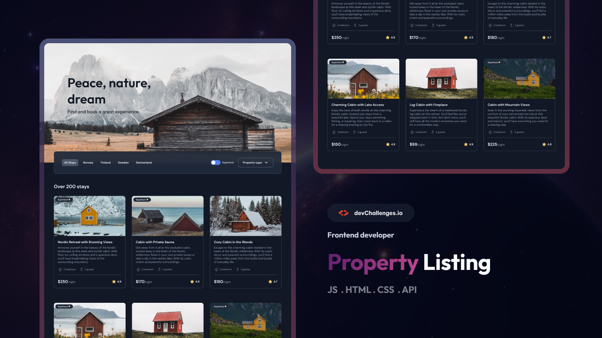

<h1 align="center">Property Listing | devChallenges</h1>

   Solution for a challenge <a href="https://devchallenges.io/challenge/property-listing" target="_blank">Property Listing
</a> from <a href="http://devchallenges.io" target="_blank">devChallenges.io</a>.

  <h3>
    <a href="https://sercansimsek.github.io/property-listing/">
      Demo
    </a>
     | 
    <a href="https://github.com/sercansimsek/property-listing">
      Solution
    </a>
     | 
    <a href="https://devchallenges.io/challenge/property-listing">
      Challenge
    </a>
  </h3>

## Table of Contents

- [Overview](#overview)
- [What I learned](#what-i-learned)
- [Useful resources](#useful-resources)
- [Built with](#built-with)
- [Features](#features)
- [Contact](#contact)

## Overview

### What I learned

Had a chance to style reusable components with Tailwind CSS.

### Useful resources

- [Tailwind cheat sheet](https://nerdcave.com/tailwind-cheat-sheet) - This helped me for to implement styles with tailwind css. I really liked this sheet and will use it going forward.

### Built with

- Semantic HTML5 markup
- CSS custom properties
- Flexbox
- CSS Grid
- [React](https://reactjs.org/)
- [Tailwind](https://tailwindcss.com/)

## Features

This application/site was created as a submission to a [DevChallenges](https://devchallenges.io/challenges-dashboard) challenge.

## Author

- GitHub [@sercansimsek](https://{github.com/sercansimsek})
